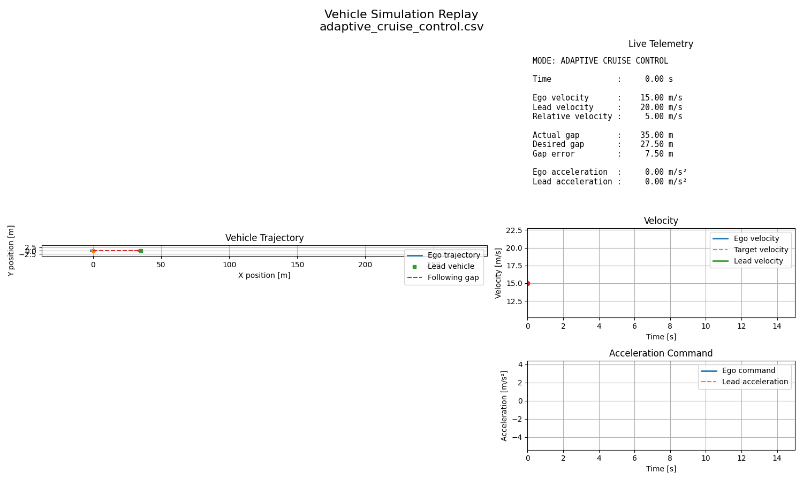
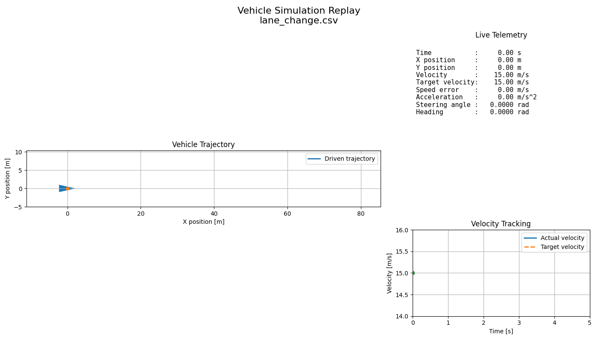

# Vehicle Simulation & Automated Validation Framework

[](https://github.com/PayalThangamma/vehicle-simulation/actions/workflows/ci.yml)

A C++ and Python vehicle simulation framework for scenario-based vehicle dynamics, closed-loop driving features, numerical-method comparison, automated validation, regression testing, visualization, and continuous integration.

This project is structured as a small-scale **Simulation Factory**: scenarios are defined in JSON, executed by a C++ simulator, validated and reprocessed with Python, compared across numerical methods, and exercised automatically through GitHub Actions.

---

## Highlights

- C++ kinematic bicycle simulation
- Explicit Euler and RK4 integration
- JSON-driven scenarios
- PI cruise control with anti-windup
- Adaptive Cruise Control with lead-vehicle braking
- Automated parameter sweeps
- Numerical convergence analysis
- Regression testing
- Python post-processing and validation
- Animated simulation replay
- CMake and CTest
- GitHub Actions CI
- One-command local simulation pipeline

---

## Adaptive Cruise Control Demo

The framework includes an Adaptive Cruise Control scenario in which a lead vehicle performs a braking maneuver and the ego vehicle automatically adjusts its longitudinal acceleration while maintaining a safe following distance.



### ACC Scenario

```text
Initial ego speed        15 m/s
Initial lead speed       20 m/s
Initial gap              35 m

Lead braking starts       4 s
Lead braking ends         6 s
Lead acceleration        -4 m/s^2

Time headway              1.5 s
Minimum following gap     5 m
```

The desired following distance is calculated as:

```text
desired_gap =
    minimum_following_distance
    + time_headway * ego_velocity
```

The ACC acceleration command uses spacing error and relative velocity:

```text
acceleration_command =
    K_gap * gap_error
    + K_relative_velocity * relative_velocity
```

The observed minimum following gap in the current ACC scenario is:

```text
21.5106 m
```

No collision occurred during the lead-vehicle braking maneuver.

---

## Additional Simulation Demo

The same visualization tool can replay generated CSV results for other scenarios, including lane changes and cruise control.



---

## Validation Summary

| Test | Result |
|---|---:|
| C++ build | PASS |
| CTest unit tests | PASS |
| Cruise-control validation | PASS |
| Adaptive Cruise Control validation | PASS |
| ACC collision avoidance | PASS |
| Turn parameter sweep | 18 / 18 PASS |
| Regression suite | 4 / 4 PASS |
| Numerical convergence | PASS |
| Euler vs RK4 analysis | PASS |
| GitHub Actions CI | PASS |

---

## Cruise-Control Performance

| Metric | Result |
|---|---:|
| Target velocity | 20.000 m/s |
| Final velocity | 20.058 m/s |
| Rise time | 4.100 s |
| Settling time | 5.600 s |
| Overshoot | 0.350% |
| Final speed error | 0.058 m/s |
| Steady-state error | 0.062 m/s |
| Selected `Kp` | 1.2 |
| Selected `Ki` | 0.05 |

---

## Numerical Integration Results

| Metric | Euler | RK4 |
|---|---:|---:|
| Mean turning-radius error | 0.399356 m | 0.000002 m |

Maximum observed final-position difference between Euler and RK4 across the turn sweep:

```text
1.945597 m
```

RK4 produced substantially lower turning-radius error for the tested curved-motion scenarios.

---

## Architecture

```text
                     +----------------------+
                     |    Scenario JSON     |
                     |----------------------|
                     | initial velocity     |
                     | acceleration         |
                     | steering             |
                     | wheelbase            |
                     | dt / duration        |
                     | integration method   |
                     | controller gains     |
                     +----------+-----------+
                                |
                                v
                     +----------------------+
                     |   Scenario Loader    |
                     |        C++           |
                     +----------+-----------+
                                |
                                v
                     +----------------------+
                     |  Vehicle Simulator   |
                     |        C++           |
                     |----------------------|
                     | Kinematic bicycle    |
                     | Euler / RK4          |
                     | PI cruise control    |
                     | ACC                  |
                     | Anti-windup          |
                     +----------+-----------+
                                |
                                v
                     +----------------------+
                     |   Simulation CSV     |
                     +----------+-----------+
                                |
                  +-------------+-------------+
                  |                           |
                  v                           v
       +----------------------+     +----------------------+
       | Python Validation    |     | Parameter Sweeps     |
       |----------------------|     |----------------------|
       | scenario checks      |     | speed                |
       | controller metrics   |     | steering angle       |
       | ACC validation       |     | Euler / RK4          |
       | regression tests     |     | timestep studies     |
       +----------+-----------+     +----------+-----------+
                  |                           |
                  +-------------+-------------+
                                |
                                v
                     +----------------------+
                     | Analysis & Reports   |
                     |----------------------|
                     | trajectory replay    |
                     | convergence plots    |
                     | controller plots     |
                     | sweep comparisons    |
                     | Markdown reports     |
                     +----------+-----------+
                                |
                                v
                     +----------------------+
                     | GitHub Actions CI    |
                     +----------------------+
```

---

## Vehicle Model

The simulator uses a kinematic bicycle model.

The vehicle state is:

```text
x       longitudinal position [m]
y       lateral position [m]
v       vehicle velocity [m/s]
theta   vehicle heading [rad]
```

The continuous-time equations are:

```text
dx/dt     = v * cos(theta)
dy/dt     = v * sin(theta)
dv/dt     = a
dtheta/dt = (v / L) * tan(delta)
```

where:

```text
a       longitudinal acceleration [m/s^2]
L       vehicle wheelbase [m]
delta   steering angle [rad]
```

For constant steering, the theoretical turning radius is:

```text
R = L / tan(delta)
```

This analytical relationship is used to validate numerical simulation results.

---

## Numerical Integration

### Explicit Euler

Euler integration updates the vehicle state using derivatives evaluated at the beginning of each timestep.

Advantages:

- Simple implementation
- Low computational cost
- Useful baseline method

Limitations:

- First-order numerical accuracy
- Increased trajectory error at larger timesteps
- Accumulated geometric error during curved motion

### Runge-Kutta 4

Runge-Kutta 4th order integration evaluates four derivative estimates during each timestep.

Advantages:

- Higher numerical accuracy
- Better curved-trajectory accuracy
- Much smaller turning-radius error
- Better behavior at larger timesteps

The integration method can be selected in a scenario JSON file:

```json
{
  "integrationMethod": "RK4"
}
```

---

## Euler vs RK4 Comparison

The framework automatically compares Euler and RK4 through a parameter sweep.

Tested vehicle velocities:

```text
10 m/s
15 m/s
20 m/s
```

Tested steering angles:

```text
0.03 rad
0.06 rad
0.09 rad
```

Integration methods:

```text
Euler
RK4
```

This produces:

```text
3 velocities
x 3 steering angles
x 2 integration methods
= 18 simulation runs
```

Current sweep result:

```text
Total runs: 18
Passed: 18
Failed: 0
```

Measured average turning-radius error:

```text
Euler: 0.399356 m
RK4:   0.000002 m
```

---

## Timestep Sensitivity Analysis

The framework evaluates:

```text
dt = 0.50 s
dt = 0.20 s
dt = 0.10 s
dt = 0.05 s
dt = 0.01 s
```

Every experiment simulates the same physical duration.

Measured Euler/RK4 final-position differences:

```text
dt = 0.50 s -> 4.007105 m
dt = 0.20 s -> 1.602196 m
dt = 0.10 s -> 0.801052 m
dt = 0.05 s -> 0.400520 m
dt = 0.01 s -> 0.080104 m
```

As the timestep becomes smaller, Euler approaches the RK4 trajectory, demonstrating numerical convergence.


---

## Cruise Control

The simulator includes a closed-loop PI speed controller.

The speed error is:

```text
speed_error = target_velocity - actual_velocity
```

The acceleration command is:

```text
acceleration_command =
    Kp * speed_error
    + Ki * integral(speed_error)
```

### Actuator Saturation

The acceleration command is constrained before being passed to the vehicle model.

Example:

```text
Minimum acceleration: -4.0 m/s^2
Maximum acceleration:  3.0 m/s^2
```

### Anti-Windup

The simulator implements **conditional-integration anti-windup**.

Integral accumulation is prevented when it would push the controller further into actuator saturation.

This improves:

- Overshoot
- Settling behavior
- Controller recovery
- Gain-tuning stability

### Automated Controller Tuning

The project evaluates multiple `Kp` and `Ki` combinations.

Acceptance criteria include:

```text
Overshoot <= 5%
Final speed error <= 0.5 m/s
Steady-state error <= 0.5 m/s
Vehicle must settle inside the 2% target band
```

The tuning process evaluated 20 controller configurations.

15 configurations satisfied all requirements.

Selected gains:

```text
Kp = 1.2
Ki = 0.05
```

Measured performance:

```text
Initial velocity:    5.000 m/s
Target velocity:    20.000 m/s
Final velocity:     20.058 m/s
Maximum velocity:   20.070 m/s

Rise time:           4.100 s
Settling time:       5.600 s
Overshoot:           0.350 %
Final speed error:   0.058 m/s
Steady-state error:  0.062 m/s
```


---

## Adaptive Cruise Control

The ACC feature extends the longitudinal controller with a simulated lead vehicle.

The controller uses:

- Actual following gap
- Desired following gap
- Gap error
- Relative velocity
- Lead-vehicle acceleration
- Configurable acceleration limits

The desired gap is:

```text
desired_gap =
    minimumFollowingDistance
    + desiredTimeHeadway * egoVelocity
```

The relative velocity is:

```text
relative_velocity =
    lead_velocity
    - ego_velocity
```

The controller command is:

```text
acceleration =
    accGapKp * gap_error
    + accRelativeVelocityKp * relative_velocity
```

The command is then clamped to the configured acceleration limits.

### ACC Validation

The automated ACC validator checks:

- Lead-vehicle braking was detected
- Ego braking response occurred
- Collision was avoided
- Minimum gap stayed above the safety threshold
- Ego velocity never became negative
- Acceleration limits were respected
- Final relative speed is small
- Final gap tracking is reasonable

---

## Scenario-Based Simulation

Simulation behavior is defined through JSON configuration files.

### Cruise-Control Example

```json
{
  "name": "Cruise Control Speed Tracking",
  "outputFile": "results/cruise_control.csv",
  "initialVelocity": 5.0,
  "acceleration": 0.0,
  "steeringAngle": 0.0,
  "wheelbase": 2.7,
  "duration": 15.0,
  "dt": 0.1,
  "integrationMethod": "RK4",
  "cruiseControlEnabled": true,
  "targetVelocity": 20.0,
  "cruiseKp": 1.2,
  "cruiseKi": 0.05,
  "minimumAcceleration": -4.0,
  "maximumAcceleration": 3.0
}
```

### ACC Example

```json
{
  "name": "Adaptive Cruise Control - Lead Vehicle Braking",
  "outputFile": "results/adaptive_cruise_control.csv",
  "initialVelocity": 15.0,
  "acceleration": 0.0,
  "steeringAngle": 0.0,
  "wheelbase": 2.7,
  "duration": 15.0,
  "dt": 0.1,
  "integrationMethod": "RK4",
  "cruiseControlEnabled": false,
  "adaptiveCruiseControlEnabled": true,
  "leadVehicleInitialDistance": 35.0,
  "leadVehicleInitialVelocity": 20.0,
  "leadVehicleBrakeStart": 4.0,
  "leadVehicleBrakeEnd": 6.0,
  "leadVehicleBrakeAcceleration": -4.0,
  "desiredTimeHeadway": 1.5,
  "minimumFollowingDistance": 5.0,
  "accGapKp": 0.35,
  "accRelativeVelocityKp": 0.8,
  "minimumAcceleration": -5.0,
  "maximumAcceleration": 3.0
}
```

This configuration-driven design allows experiments to be changed without recompiling the simulator.

---

## Steering Schedules

Scenarios can contain time-dependent steering commands.

Example:

```json
{
  "steeringSchedule": [
    {
      "start": 1.0,
      "end": 2.0,
      "angle": 0.08
    },
    {
      "start": 2.0,
      "end": 3.0,
      "angle": -0.08
    }
  ]
}
```

This mechanism is used for lane-change scenarios.

---

## Implemented Scenarios

### Straight Acceleration

Tests longitudinal acceleration behavior.

### Emergency Braking

Tests deceleration and non-negative velocity clamping.

### Constant Turn

Tests curved motion against the analytical turning radius.

### Lane Change

Tests time-dependent steering events, lateral displacement, and heading evolution.

### Cruise Control

Tests closed-loop speed tracking with PI control, actuator limits, and anti-windup.

### Adaptive Cruise Control

Tests a lead-vehicle braking event and validates the ego vehicle response and following-gap behavior.

---

## Automated Parameter Sweeps

Current turn sweep:

```json
{
  "name": "Turn Sweep",
  "initialVelocityValues": [10.0, 15.0, 20.0],
  "steeringAngleValues": [0.03, 0.06, 0.09],
  "integrationMethods": ["Euler", "RK4"],
  "acceleration": 0.0,
  "wheelbase": 2.7,
  "duration": 4.0,
  "dt": 0.1
}
```

Generated scenarios are placed in:

```text
scenarios/generated/
```

The sweep report calculates:

- Analytical turning radius
- Measured trajectory radius
- Absolute radius error
- Percentage radius error
- Final X position
- Final Y position
- Final heading
- Euler/RK4 final-position difference

---

## Regression Testing

Validated reference trajectories are stored as baselines.

Current baseline scenarios:

```text
acceleration
constant_turn
emergency_braking
lane_change
```

Each new result is compared with its reference baseline using RMSE for:

```text
X trajectory
Y trajectory
velocity
heading
```

Current result:

```text
Total baselines: 4
Passed: 4
Failed: 0
Missing: 0
```

---

## C++ Unit Tests

Model-level tests are executed using CTest.

Coverage includes:

- Acceleration behavior
- Braking behavior
- Zero-velocity clamping
- Straight-line Euler integration
- Steering with Euler integration
- Straight-line RK4 integration
- Steering with RK4 integration

---

## Automated Validation

Python scripts validate simulation results.

Validation includes:

- No negative velocity
- Commanded acceleration behavior
- Measured acceleration
- Trajectory behavior
- Cruise-control tracking requirements
- ACC safety and tracking checks
- Turning-radius accuracy
- Regression RMSE
- Numerical convergence

Validation failures return a non-zero exit code and fail the automated workflow.

---

## Simulation Data Output

Each simulation generates CSV output.

Base columns include:

```text
time
x
y
velocity
heading
commanded_acceleration
steering_angle
wheelbase
target_velocity
speed_error
```

ACC simulations additionally include:

```text
lead_vehicle_position
lead_vehicle_velocity
lead_vehicle_acceleration
actual_gap
desired_gap
gap_error
relative_velocity
```

---

## Data Reprocessing and Visualization

Python is used for:

- CSV loading
- Validation
- Metric extraction
- Trajectory plotting
- Controller performance analysis
- ACC analysis
- Regression comparison
- Parameter-sweep comparison
- Convergence analysis
- Animated simulation replay
- Report generation

The simulation engine and visualization are intentionally separated. The C++ simulator writes data, while Python independently replays and analyzes the generated results.

---

## Automated Local Pipeline

Run:

```powershell
.\run_pipeline.ps1
```

The local pipeline performs:

```text
Step 1   Generate Euler/RK4 sweep scenarios
Step 2   Configure the CMake project
Step 3   Build all C++ targets
Step 4   Run CTest
Step 5   Execute simulation scenarios
Step 6   Run standard scenario validation
Step 7   Run cruise-control validation
Step 8   Generate Euler/RK4 sweep report
Step 9   Run regression suite
Step 10  Run standalone Euler vs RK4 comparison
Step 11  Run timestep sensitivity experiment
Step 12  Generate convergence analysis
Step 13  Generate Euler/RK4 sweep plots
Step 14  Generate the final simulation report
```

The GitHub Actions workflow additionally runs the ACC scenario and ACC validation.

---

## Continuous Integration

The repository includes:

```text
.github/workflows/ci.yml
```

The GitHub Actions workflow automatically:

1. Checks out the repository
2. Sets up Python
3. Installs analysis dependencies
4. Configures CMake
5. Builds the C++ targets
6. Runs CTest
7. Generates parameter-sweep scenarios
8. Runs the standard simulations
9. Runs the ACC scenario
10. Validates standard simulation output
11. Validates cruise control
12. Validates Adaptive Cruise Control
13. Generates the sweep report
14. Runs regression tests
15. Executes Euler/RK4 comparison
16. Executes timestep sensitivity analysis
17. Verifies the timestep CSV artifact
18. Runs convergence analysis

A failed build, test, or validation causes the workflow to fail.

---

## Project Structure

```text
vehicle-simulation/
|
|-- .github/
|   `-- workflows/
|       `-- ci.yml
|
|-- CMakeLists.txt
|-- run_pipeline.ps1
|-- README.md
|-- .gitignore
|
|-- include/
|   |-- scenario.hpp
|   |-- scenario_loader.hpp
|   |-- simulator.hpp
|   |-- vehicle_model.hpp
|   `-- json.hpp
|
|-- src/
|   |-- main.cpp
|   |-- scenario_loader.cpp
|   |-- simulator.cpp
|   `-- vehicle_model.cpp
|
|-- scenarios/
|   |-- acceleration.json
|   |-- emergency_braking.json
|   |-- constant_turn.json
|   |-- lane_change.json
|   |-- cruise_control.json
|   |-- adaptive_cruise_control.json
|   `-- generated/
|
|-- sweeps/
|   `-- turn_sweep.json
|
|-- tests/
|   |-- test_vehicle_model.cpp
|   |-- integration_compare.cpp
|   `-- timestep_sensitivity.cpp
|
|-- analysis/
|   |-- analyze.py
|   |-- analyze_cruise_control.py
|   |-- analyze_acc.py
|   |-- visualize_simulation.py
|   |-- cruise_tuning_sweep.py
|   |-- select_cruise_gains.py
|   |-- generate_sweep.py
|   |-- sweep_report.py
|   |-- regression_test.py
|   |-- plot_convergence.py
|   |-- plot_integration_comparison.py
|   `-- generate_report.py
|
|-- baselines/
|   |-- acceleration_baseline.csv
|   |-- emergency_braking_baseline.csv
|   |-- constant_turn_baseline.csv
|   |-- lane_change_baseline.csv
|   `-- legacy/
|
|-- docs/
|   |-- adaptive_cruise_control_demo.gif
|   |-- lane_change_demo.gif
|   |-- cruise_control_tracking.png
|   |-- timestep_convergence.png
|   |-- euler_rk4_radius_error.png
|   `-- euler_rk4_position_difference.png
|
|-- results/
|
`-- build-cmake/
```

---

## Requirements

### C++

- C++17
- CMake
- GCC / MinGW-w64

Development environment used:

```text
MSYS2 UCRT64 GCC
CMake
CTest
```

### Python

Python 3.12 with:

```text
pandas
matplotlib
pillow
```

Install dependencies:

```powershell
python -m pip install pandas matplotlib pillow
```

---

## Build Instructions

### Configure

```powershell
C:\msys64\ucrt64\bin\cmake.exe -S . -B build-cmake
```

### Build

```powershell
C:\msys64\ucrt64\bin\cmake.exe --build build-cmake
```

Clean rebuild:

```powershell
C:\msys64\ucrt64\bin\cmake.exe --build build-cmake --clean-first
```

### Run C++ Tests

```powershell
C:\msys64\ucrt64\bin\ctest.exe --test-dir build-cmake --output-on-failure
```

---

## Running Simulations

### Run All Standard Scenarios

```powershell
.\build-cmake\main.exe
```

### Run Cruise Control

```powershell
.\build-cmake\main.exe .\scenarios\cruise_control.json
```

### Run Adaptive Cruise Control

```powershell
.\build-cmake\main.exe .\scenarios\adaptive_cruise_control.json
```

---

## Validation Commands

### Standard Scenarios

```powershell
python .\analysis\analyze.py
```

### Cruise Control

```powershell
python .\analysis\analyze_cruise_control.py
```

### Adaptive Cruise Control

```powershell
python .\analysis\analyze_acc.py
```

### Regression Tests

```powershell
python .\analysis\regression_test.py
```

---

## Controller Tuning

Run the tuning sweep:

```powershell
python .\analysis\cruise_tuning_sweep.py
```

Then select the best valid controller:

```powershell
python .\analysis\select_cruise_gains.py
```

Current selected gains:

```text
Kp = 1.2
Ki = 0.05
```

---

## Parameter Sweep

Generate sweep scenarios:

```powershell
python .\analysis\generate_sweep.py
```

Run the simulator:

```powershell
.\build-cmake\main.exe
```

Generate the report:

```powershell
python .\analysis\sweep_report.py
```

---

## Numerical Analysis

### Euler vs RK4

```powershell
.\build-cmake\integration_compare.exe
```

### Timestep Sensitivity

```powershell
.\build-cmake\timestep_sensitivity.exe
```

### Convergence Analysis

```powershell
python .\analysis\plot_convergence.py
```

### Euler/RK4 Sweep Plots

```powershell
python .\analysis\plot_integration_comparison.py
```

---

## Simulation Replay

Replay the cruise-control result:

```powershell
python .\analysis\visualize_simulation.py .\results\cruise_control.csv
```

Replay the lane-change result:

```powershell
python .\analysis\visualize_simulation.py .\results\lane_change.csv
```

Replay Adaptive Cruise Control:

```powershell
python .\analysis\visualize_simulation.py .\results\adaptive_cruise_control.csv
```

Export an ACC GIF:

```powershell
python .\analysis\visualize_simulation.py .\results\adaptive_cruise_control.csv --save-gif
```

---

## Generated Outputs

Representative outputs include:

```text
results/acceleration.csv
results/emergency_braking.csv
results/constant_turn.csv
results/lane_change.csv
results/cruise_control.csv
results/adaptive_cruise_control.csv

results/cruise_control_tuning_summary.csv
results/turn_sweep_summary.csv
results/integration_method_comparison.csv
results/timestep_sensitivity.csv

results/cruise_control_tracking.png
results/timestep_convergence.png
results/euler_rk4_position_difference.png
results/euler_rk4_radius_error.png
results/simulation_report.md
```

Selected demonstration assets are copied into `docs/` so they can be rendered directly on GitHub.

---

## Engineering Concepts Demonstrated

### C++

- Modular C++17 architecture
- Struct-based state representation
- Numerical simulation
- Filesystem handling
- JSON configuration
- Exception handling
- CMake build configuration

### Vehicle Dynamics

- Kinematic bicycle model
- Longitudinal motion
- Lateral motion
- Steering inputs
- Heading evolution
- Constant-radius turning
- Lane-change maneuver simulation

### Control Systems

- Closed-loop feedback
- PI control
- Proportional and integral action
- Actuator saturation
- Integral windup
- Anti-windup
- Controller gain tuning
- Adaptive Cruise Control
- Relative-velocity feedback
- Time-headway spacing policy

### Numerical Methods

- Explicit Euler integration
- Runge-Kutta 4th order integration
- Timestep sensitivity
- Numerical convergence
- Analytical validation
- Numerical error comparison

### Simulation Validation

- Automated scenario validation
- Quantitative acceptance criteria
- Regression baselines
- RMSE-based comparison
- Parameter sweeps
- Automated pass/fail decisions
- ACC collision-avoidance checks

### Automation

- CMake
- CTest
- PowerShell
- Python
- GitHub Actions
- One-command simulation pipeline
- Generated experiments
- Automated validation
- Automated reports

---

## Design Decisions

### Why JSON?

JSON separates simulation configuration from implementation and allows scenarios to be modified without recompiling C++ code.

### Why C++ for Simulation?

C++ is well suited to performance-sensitive simulation workflows and provides experience with deterministic loops, numerical integration, strongly typed interfaces, and compiled model components.

### Why Python for Analysis?

Python provides a convenient environment for data processing, validation, plotting, controller tuning, visualization, and report generation.

### Why Euler and RK4?

Euler provides a simple baseline integrator, while RK4 provides substantially higher numerical accuracy. Comparing them allows the project to study timestep effects, convergence, trajectory error, and integration tradeoffs.

### Why Regression Testing?

A simulator can still compile after a change unintentionally alters model behavior. Regression testing detects these changes by comparing new trajectories against validated references.

### Why Separate Simulation and Visualization?

The C++ simulator writes deterministic CSV outputs, while Python independently replays and analyzes those outputs. This keeps the simulation engine decoupled from presentation and post-processing.

---

## Future Extensions

Potential extensions include:

### Vehicle Model

- Aerodynamic drag
- Rolling resistance
- Road inclination
- Dynamic bicycle model
- Lateral tire forces
- Pacejka tire model
- Vehicle mass and yaw dynamics

### Driving Features

- Automatic emergency braking
- Lane keeping
- Trajectory tracking
- More advanced ACC strategies

### Scenario System

- YAML support
- Scenario inheritance
- Environment conditions
- Road curvature
- Disturbances
- Sensor noise

### Simulation Automation

- Parallel simulation execution
- Multiprocessing
- Distributed batch execution
- Docker
- Linux support
- Cloud simulation workers

### Validation

- Monte Carlo validation
- Statistical metrics
- Simulation coverage reporting
- Automatic requirement mapping
- Configurable tolerance files

### MATLAB / Simulink

A future extension could implement the same vehicle model in MATLAB/Simulink and compare:

```text
C++ simulation output
vs
Simulink simulation output
```

This would provide cross-tool model validation.

---

## Current Status

```text
Vehicle model                    COMPLETE
Euler integration                COMPLETE
RK4 integration                  COMPLETE
JSON scenarios                   COMPLETE
Acceleration scenario            COMPLETE
Emergency braking                COMPLETE
Constant-turn scenario           COMPLETE
Lane-change scenario             COMPLETE
Cruise control                   COMPLETE
PI controller                    COMPLETE
Actuator saturation              COMPLETE
Anti-windup                      COMPLETE
Controller tuning                COMPLETE
Controller validation            COMPLETE
Adaptive Cruise Control          COMPLETE
Lead-vehicle simulation          COMPLETE
ACC validation                   COMPLETE
Animated simulation replay       COMPLETE
Parameter sweep                  COMPLETE
Euler/RK4 comparison             COMPLETE
Regression testing               COMPLETE
Timestep sensitivity             COMPLETE
Convergence analysis             COMPLETE
Automated plots                  COMPLETE
Automated report generation      COMPLETE
GitHub Actions CI                COMPLETE
One-command local pipeline       COMPLETE
```

---

## Final Validation Summary

```text
Cruise-control validation:        PASS
Adaptive Cruise Control:          PASS
ACC collision avoidance:          PASS
Turn sweep:                 18 / 18 PASS
Regression suite:              4 / 4 PASS
Numerical convergence:          PASS
Euler vs RK4 analysis:          PASS
GitHub Actions CI:              PASS
```

---

## Summary

This project implements a compact automated vehicle simulation environment combining:

```text
C++ vehicle simulation
JSON scenario configuration
Euler and RK4 integration
PI cruise control
Anti-windup
Adaptive Cruise Control
Lead-vehicle simulation
Controller tuning
Automated parameter sweeps
Python data reprocessing
Animated simulation replay
Numerical convergence analysis
Regression testing
Automated validation
GitHub Actions CI
Visualization
Report generation
```

Run the local workflow with:

```powershell
.\run_pipeline.ps1
```

The repository demonstrates a reproducible simulation-and-validation workflow built around vehicle dynamics, driving-feature integration, numerical analysis, automated testing, and continuous integration.
