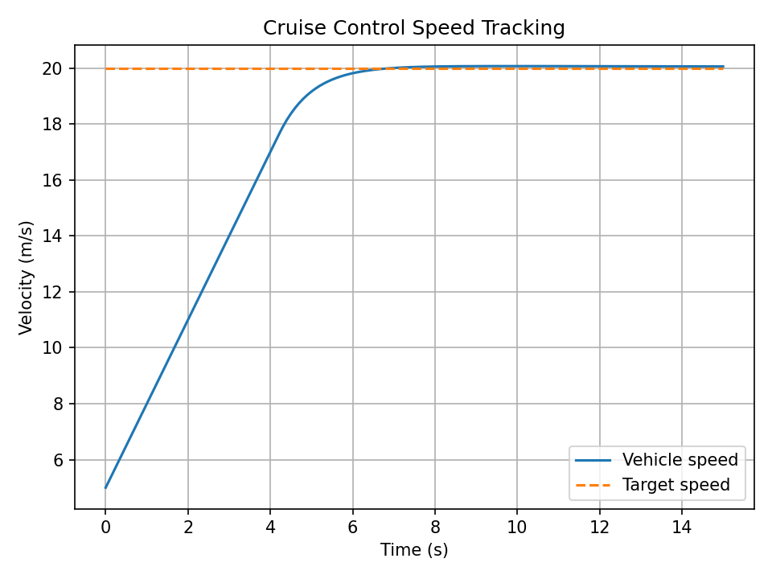
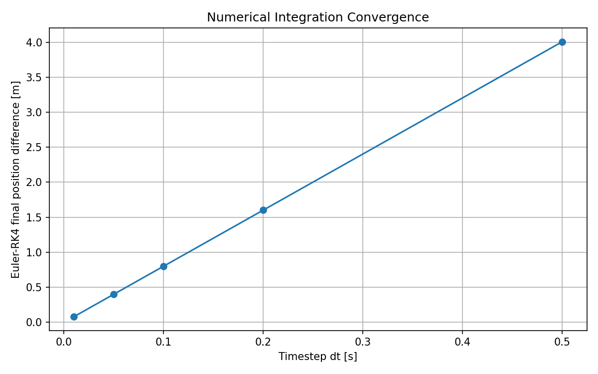
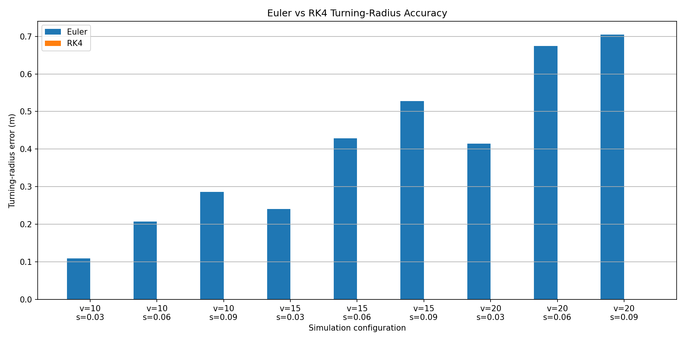
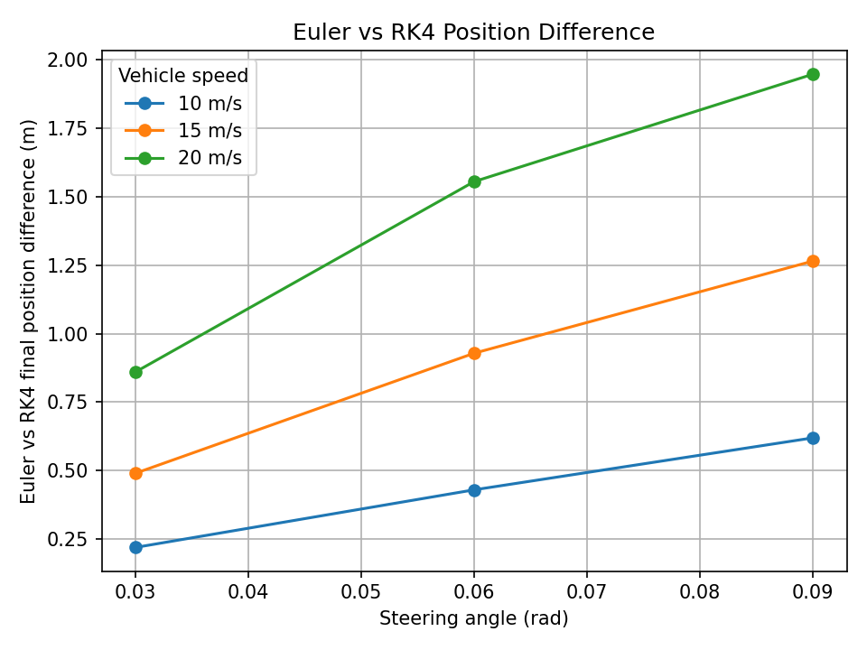

# Vehicle Simulation & Automated Validation Framework

A C++ and Python framework for vehicle dynamics simulation, numerical integration analysis, automated scenario execution, controller validation, regression testing, parameter sweeps, and simulation-data reprocessing.

This project is designed as a small-scale **Simulation Factory**: scenarios are defined in JSON, executed by a C++ vehicle simulator, validated automatically with Python, compared across numerical methods, and summarized through generated plots and reports.

---

## Project Overview

The framework implements a configurable vehicle simulation environment based on a kinematic bicycle model.

It supports:

- JSON-driven simulation scenarios
- C++ vehicle dynamics simulation
- Explicit Euler integration
- Runge-Kutta 4th order integration
- Straight-line acceleration
- Emergency braking
- Constant-radius turning
- Lane-change steering profiles
- PI cruise control
- Actuator acceleration limits
- PI anti-windup
- Automated controller gain tuning
- Automated parameter sweeps
- Euler vs RK4 numerical comparison
- Timestep sensitivity analysis
- Numerical convergence analysis
- Automated regression testing
- Python-based result validation
- Trajectory visualization
- Automated report generation
- One-command end-to-end execution

The goal is to demonstrate how vehicle simulation models can be implemented, tested, validated, reprocessed, and executed repeatedly through an automated workflow.

---

## Results

### Cruise-Control Tracking



### Numerical Convergence



### Euler vs RK4 Turning-Radius Error



### Euler vs RK4 Final-Position Difference



## Architecture

```text
                     +----------------------+
                     |    Scenario JSON     |
                     |----------------------|
                     | initial velocity     |
                     | acceleration         |
                     | steering             |
                     | wheelbase            |
                     | dt / duration        |
                     | integration method   |
                     | controller gains     |
                     +----------+-----------+
                                |
                                v
                     +----------------------+
                     |   Scenario Loader    |
                     |        C++           |
                     +----------+-----------+
                                |
                                v
                     +----------------------+
                     |  Vehicle Simulator   |
                     |        C++           |
                     |----------------------|
                     | Kinematic bicycle    |
                     | Euler                |
                     | RK4                  |
                     | PI cruise control    |
                     | Anti-windup          |
                     +----------+-----------+
                                |
                                v
                     +----------------------+
                     |   Simulation CSV     |
                     +----------+-----------+
                                |
                  +-------------+-------------+
                  |                           |
                  v                           v
       +----------------------+     +----------------------+
       | Python Validation    |     | Parameter Sweeps     |
       |----------------------|     |----------------------|
       | scenario checks      |     | speed                |
       | controller metrics   |     | steering angle       |
       | regression tests     |     | Euler / RK4          |
       +----------+-----------+     +----------+-----------+
                  |                           |
                  +-------------+-------------+
                                |
                                v
                     +----------------------+
                     | Analysis & Reports   |
                     |----------------------|
                     | trajectory plots     |
                     | convergence plots    |
                     | controller plots     |
                     | sweep comparisons    |
                     | Markdown report      |
                     +----------------------+
```

---

## Vehicle Model

The simulator uses a kinematic bicycle model.

The vehicle state is:

```text
x       longitudinal position [m]
y       lateral position [m]
v       vehicle velocity [m/s]
theta   vehicle heading [rad]
```

The continuous-time equations are:

```text
dx/dt     = v * cos(theta)
dy/dt     = v * sin(theta)
dv/dt     = a
dtheta/dt = (v / L) * tan(delta)
```

where:

```text
a       longitudinal acceleration [m/s^2]
L       vehicle wheelbase [m]
delta   steering angle [rad]
```

For constant steering, the theoretical turning radius is:

```text
R = L / tan(delta)
```

This analytical relationship is used to validate numerical simulation results.

---

## Numerical Integration

### Explicit Euler

Euler integration updates the vehicle state using derivatives evaluated at the beginning of each timestep.

Advantages:

- Simple implementation
- Low computational cost
- Useful baseline method

Limitations:

- First-order numerical accuracy
- Increased trajectory error at larger timesteps
- Accumulated geometric error during curved motion

### Runge-Kutta 4

Runge-Kutta 4th order integration evaluates four derivative estimates during each timestep.

Advantages:

- Significantly higher numerical accuracy
- Better curved-trajectory accuracy
- Much smaller turning-radius error
- Better behavior at larger timesteps

The integration method can be selected directly in a scenario JSON file:

```json
{
  "integrationMethod": "RK4"
}
```

---

## Euler vs RK4 Comparison

The framework automatically compares Euler and RK4 through a parameter sweep.

Tested vehicle velocities:

```text
10 m/s
15 m/s
20 m/s
```

Tested steering angles:

```text
0.03 rad
0.06 rad
0.09 rad
```

Integration methods:

```text
Euler
RK4
```

This produces:

```text
3 velocities
x 3 steering angles
x 2 integration methods
= 18 simulation runs
```

All 18 sweep runs passed validation.

Measured average turning-radius error:

```text
Euler: approximately 0.399356 m
RK4:   approximately 0.000002 m
```

Maximum observed final-position difference between Euler and RK4:

```text
1.945597 m
```

These results demonstrate the higher trajectory accuracy of RK4 for curved vehicle motion.

---

## Timestep Sensitivity Analysis

The framework evaluates numerical behavior using:

```text
dt = 0.50 s
dt = 0.20 s
dt = 0.10 s
dt = 0.05 s
dt = 0.01 s
```

Every experiment simulates the same physical duration.

Corrected Euler/RK4 final-position differences:

```text
dt = 0.50 s  -> 4.007105 m
dt = 0.20 s  -> 1.602196 m
dt = 0.10 s  -> 0.801052 m
dt = 0.05 s  -> 0.400520 m
dt = 0.01 s  -> 0.080104 m
```

As the timestep becomes smaller, Euler approaches the RK4 trajectory. This demonstrates numerical convergence and verifies that the simulation behaves consistently as temporal resolution increases.

---

## Cruise Control

The simulator includes a closed-loop PI speed controller.

The speed tracking error is:

```text
speed_error = target_velocity - actual_velocity
```

The acceleration command is:

```text
acceleration_command =
    Kp * speed_error
    + Ki * integral(speed_error)
```

The controller operates directly inside the simulation loop.

### Actuator Saturation

The acceleration command is constrained to defined limits.

Example:

```text
Minimum acceleration: -4.0 m/s^2
Maximum acceleration:  3.0 m/s^2
```

The acceleration command is clamped before being passed to the vehicle model.

### Anti-Windup

PI controllers can experience integral windup while actuator commands are saturated.

The simulator implements **conditional-integration anti-windup**. Integral accumulation is prevented when it would push the controller further into saturation.

This improves:

- Overshoot
- Settling behavior
- Controller recovery
- Gain-tuning stability

---

## Automated Controller Tuning

The project includes an automated PI gain sweep over multiple `Kp` and `Ki` combinations.

For every configuration, the simulation measures:

- Rise time
- Settling time
- Overshoot
- Final speed error
- Steady-state error
- Controller acceleration effort

Acceptance criteria:

```text
Overshoot <= 5%
Final speed error <= 0.5 m/s
Steady-state error <= 0.5 m/s
Vehicle must settle inside the 2% target band
```

The tuning process evaluated 20 controller configurations.

15 configurations satisfied all engineering requirements.

Selected gains:

```text
Kp = 1.2
Ki = 0.05
```

Measured performance:

```text
Initial velocity:    5.000 m/s
Target velocity:    20.000 m/s
Final velocity:     20.058 m/s
Maximum velocity:   20.070 m/s

Rise time:           4.100 s
Settling time:       5.600 s
Overshoot:           0.350 %
Final speed error:   0.058 m/s
Steady-state error:  0.062 m/s
```

Controller validation:

```text
Final speed error <= 0.5 m/s: PASS
Overshoot <= 5%: PASS
Steady-state error <= 0.5 m/s: PASS
Settled inside 2% band: PASS
```

---

## Scenario-Based Simulation

Simulation behavior is defined through JSON configuration files.

Example:

```json
{
  "name": "Cruise Control Speed Tracking",
  "outputFile": "results/cruise_control.csv",
  "initialVelocity": 5.0,
  "acceleration": 0.0,
  "steeringAngle": 0.0,
  "wheelbase": 2.7,
  "duration": 15.0,
  "dt": 0.1,
  "integrationMethod": "RK4",
  "cruiseControlEnabled": true,
  "targetVelocity": 20.0,
  "cruiseKp": 1.2,
  "cruiseKi": 0.05,
  "minimumAcceleration": -4.0,
  "maximumAcceleration": 3.0
}
```

This allows experiments to be modified without recompiling the C++ simulator.

---

## Steering Schedules

Scenarios can contain time-dependent steering commands.

Example:

```json
{
  "steeringSchedule": [
    {
      "start": 1.0,
      "end": 2.0,
      "angle": 0.08
    },
    {
      "start": 2.0,
      "end": 3.0,
      "angle": -0.08
    }
  ]
}
```

This mechanism is used for lane-change scenarios.

---

## Implemented Scenarios

### Straight Acceleration

Tests longitudinal acceleration behavior.

Example:

```text
Initial velocity: 5 m/s
Acceleration: 2 m/s^2
Steering angle: 0 rad
```

### Emergency Braking

Tests vehicle deceleration and non-negative velocity clamping.

Example:

```text
Initial velocity: 25 m/s
Acceleration: -6 m/s^2
```

### Constant Turn

Tests continuous curved vehicle motion and compares the simulated trajectory with the analytical turning radius:

```text
R = L / tan(delta)
```

### Lane Change

Uses time-dependent steering events to validate:

- Steering schedules
- Lateral displacement
- Heading evolution
- Scenario-driven control input changes

### Cruise Control

Tests closed-loop longitudinal speed tracking from:

```text
5 m/s
```

to:

```text
20 m/s
```

using PI control, actuator limits, and anti-windup.

---

## Automated Parameter Sweeps

The project automatically generates scenario files from parameter combinations.

Current turn sweep configuration:

```json
{
  "name": "Turn Sweep",
  "initialVelocityValues": [
    10.0,
    15.0,
    20.0
  ],
  "steeringAngleValues": [
    0.03,
    0.06,
    0.09
  ],
  "integrationMethods": [
    "Euler",
    "RK4"
  ],
  "acceleration": 0.0,
  "wheelbase": 2.7,
  "duration": 4.0,
  "dt": 0.1
}
```

Generated scenario files are placed in:

```text
scenarios/generated/
```

The C++ executable automatically discovers and executes them.

### Sweep Validation

The sweep report calculates:

- Expected analytical turning radius
- Measured trajectory radius
- Absolute radius error
- Percentage radius error
- Final X position
- Final Y position
- Final heading
- Euler/RK4 final-position difference

Current result:

```text
Total runs: 18
Passed: 18
Failed: 0
```

---

## Regression Testing

Validated reference trajectories are stored as baselines.

Current baseline scenarios:

```text
acceleration
constant_turn
emergency_braking
lane_change
```

Each new result is compared with its reference baseline using RMSE for:

```text
X trajectory
Y trajectory
velocity
heading
```

Current regression result:

```text
Total baselines: 4
Passed: 4
Failed: 0
Missing: 0
```

This detects unintended changes in simulator behavior.

---

## C++ Unit Tests

Model-level tests are executed using CTest.

Coverage includes:

- Acceleration behavior
- Braking behavior
- Zero-velocity clamping
- Straight-line Euler integration
- Steering with Euler integration
- Straight-line RK4 integration
- Steering with RK4 integration

---

## Automated Validation

Python scripts validate simulation results.

Validation includes:

- No negative velocity
- Commanded acceleration behavior
- Measured acceleration
- Acceleration error
- Trajectory behavior
- Cruise-control tracking requirements
- Turning-radius accuracy
- Regression RMSE
- Numerical convergence

Validation failures return a non-zero exit code and stop the pipeline.

---

## Simulation Data Output

Each simulation generates CSV output with columns such as:

```text
time
x
y
velocity
heading
commanded_acceleration
steering_angle
wheelbase
target_velocity
speed_error
```

This allows simulation output to be reprocessed independently from the C++ engine.

---

## Data Reprocessing

Python is used for:

- CSV loading
- Validation
- Metric extraction
- Trajectory plotting
- Controller performance analysis
- Regression comparison
- Parameter-sweep comparison
- Convergence analysis
- Report generation

This separates simulation execution from post-processing and mirrors larger engineering simulation workflows.

---

## Automated Pipeline

Run the complete workflow with:

```powershell
.\run_pipeline.ps1
```

The pipeline performs:

```text
Step 1   Generate Euler/RK4 sweep scenarios
Step 2   Configure the CMake project
Step 3   Build all C++ targets
Step 4   Run CTest
Step 5   Execute simulation scenarios
Step 6   Run standard scenario validation
Step 7   Run cruise-control validation
Step 8   Generate Euler/RK4 sweep report
Step 9   Run regression suite
Step 10  Run standalone Euler vs RK4 comparison
Step 11  Run timestep sensitivity experiment
Step 12  Generate convergence analysis
Step 13  Generate Euler/RK4 sweep plots
Step 14  Generate the final simulation report
```

A failed validation step terminates the pipeline.

Successful execution ends with:

```text
PIPELINE COMPLETED SUCCESSFULLY
```

---

## Project Structure

```text
vehicle-simulation/
|
|-- CMakeLists.txt
|-- run_pipeline.ps1
|-- README.md
|
|-- include/
|   |-- scenario.hpp
|   |-- scenario_loader.hpp
|   |-- simulator.hpp
|   |-- vehicle_model.hpp
|   `-- json.hpp
|
|-- src/
|   |-- main.cpp
|   |-- scenario_loader.cpp
|   |-- simulator.cpp
|   `-- vehicle_model.cpp
|
|-- scenarios/
|   |-- acceleration.json
|   |-- emergency_braking.json
|   |-- constant_turn.json
|   |-- lane_change.json
|   |-- cruise_control.json
|   `-- generated/
|
|-- sweeps/
|   `-- turn_sweep.json
|
|-- tests/
|   |-- test_vehicle_model.cpp
|   |-- integration_compare.cpp
|   `-- timestep_sensitivity.cpp
|
|-- analysis/
|   |-- analyze.py
|   |-- analyze_cruise_control.py
|   |-- cruise_tuning_sweep.py
|   |-- select_cruise_gains.py
|   |-- generate_sweep.py
|   |-- sweep_report.py
|   |-- regression_test.py
|   |-- plot_convergence.py
|   |-- plot_integration_comparison.py
|   `-- generate_report.py
|
|-- baselines/
|   |-- acceleration_baseline.csv
|   |-- emergency_braking_baseline.csv
|   |-- constant_turn_baseline.csv
|   |-- lane_change_baseline.csv
|   `-- legacy/
|
|-- results/
|
`-- build-cmake/
```

---

## Requirements

### C++

- C++17
- CMake
- GCC / MinGW-w64

Development environment used:

```text
MSYS2 UCRT64 GCC
CMake
CTest
```

### Python

Python 3 with:

```text
pandas
matplotlib
```

Install dependencies:

```powershell
python -m pip install pandas matplotlib
```

---

## Build Instructions

### Configure

```powershell
C:\msys64\ucrt64\bin\cmake.exe -S . -B build-cmake
```

### Build

```powershell
C:\msys64\ucrt64\bin\cmake.exe --build build-cmake
```

Clean rebuild:

```powershell
C:\msys64\ucrt64\bin\cmake.exe --build build-cmake --clean-first
```

### Run C++ Tests

```powershell
C:\msys64\ucrt64\bin\ctest.exe --test-dir build-cmake --output-on-failure
```

---

## Running Simulations

### Run All Standard Scenarios

```powershell
.\build-cmake\main.exe
```

This executes standard scenarios and generated sweep scenarios.

### Run a Single Scenario

```powershell
.\build-cmake\main.exe .\scenarios\cruise_control.json
```

Other examples:

```powershell
.\build-cmake\main.exe .\scenarios\acceleration.json
```

```powershell
.\build-cmake\main.exe .\scenarios\constant_turn.json
```

Single-scenario mode is useful for:

- Debugging
- Controller tuning
- Batch execution
- Automated experiment orchestration

---

## Controller Tuning

Run:

```powershell
python .\analysis\cruise_tuning_sweep.py
```

This generates:

```text
results/cruise_control_tuning_summary.csv
```

Then select the best valid controller:

```powershell
python .\analysis\select_cruise_gains.py
```

The selection script:

1. Loads tuning results
2. Applies engineering acceptance criteria
3. Filters invalid controllers
4. Ranks valid controllers
5. Selects the best configuration
6. Updates `scenarios/cruise_control.json`

Current selected gains:

```text
Kp = 1.2
Ki = 0.05
```

---

## Cruise-Control Validation

Run the scenario:

```powershell
.\build-cmake\main.exe .\scenarios\cruise_control.json
```

Then validate:

```powershell
python .\analysis\analyze_cruise_control.py
```

Expected result:

```text
Final speed error <= 0.5 m/s: True
Overshoot <= 5%: True
Steady-state error <= 0.5 m/s: True
Settled inside 2% band: True

CRUISE CONTROL RESULT: PASS
```

---

## Parameter Sweep

Generate sweep scenarios:

```powershell
python .\analysis\generate_sweep.py
```

Run the simulator:

```powershell
.\build-cmake\main.exe
```

Generate the report:

```powershell
python .\analysis\sweep_report.py
```

---

## Regression Tests

```powershell
python .\analysis\regression_test.py
```

Expected result:

```text
Total baselines: 4
Passed: 4
Failed: 0
Missing: 0

OVERALL REGRESSION RESULT: PASS
```

---

## Numerical Analysis

### Euler vs RK4

```powershell
.\build-cmake\integration_compare.exe
```

### Timestep Sensitivity

```powershell
.\build-cmake\timestep_sensitivity.exe
```

### Convergence Analysis

```powershell
python .\analysis\plot_convergence.py
```

### Euler/RK4 Sweep Plots

```powershell
python .\analysis\plot_integration_comparison.py
```

---

## Generated Outputs

Important outputs include:

```text
results/acceleration.csv
results/emergency_braking.csv
results/constant_turn.csv
results/lane_change.csv
results/cruise_control.csv

results/cruise_control_tracking.png
results/cruise_control_tuning_summary.csv

results/turn_sweep_summary.csv
results/integration_method_comparison.csv

results/timestep_sensitivity.csv
results/timestep_convergence.png

results/euler_rk4_position_difference.png
results/euler_rk4_radius_error.png

results/simulation_report.md
```

---

## Key Results

### Cruise Controller

```text
Kp:                  1.2
Ki:                  0.05
Target velocity:    20 m/s
Final velocity:     20.058 m/s
Rise time:           4.1 s
Settling time:       5.6 s
Overshoot:           0.35 %
Final error:         0.058 m/s
Steady-state error:  0.062 m/s
```

### Numerical Integration

```text
Euler mean radius error: 0.399356 m
RK4 mean radius error:   0.000002 m
```

### Timestep Convergence

```text
dt = 0.50 s -> 4.007105 m
dt = 0.20 s -> 1.602196 m
dt = 0.10 s -> 0.801052 m
dt = 0.05 s -> 0.400520 m
dt = 0.01 s -> 0.080104 m
```

---

## Engineering Concepts Demonstrated

### C++

- Modular application architecture
- C++17
- Struct-based state representation
- Numerical simulation
- Filesystem handling
- File-based configuration
- Exception handling
- CMake build configuration

### Vehicle Dynamics

- Kinematic bicycle model
- Longitudinal dynamics
- Lateral motion
- Steering-angle inputs
- Heading evolution
- Constant-radius turning
- Lane-change maneuver modeling

### Control Systems

- Closed-loop feedback
- PI control
- Proportional and integral action
- Actuator saturation
- Integral windup
- Anti-windup
- Controller gain tuning
- Transient-response analysis
- Steady-state error analysis

### Numerical Methods

- Explicit Euler integration
- Runge-Kutta 4th order integration
- Timestep sensitivity
- Convergence behavior
- Analytical validation
- Numerical error comparison

### Simulation Validation

- Automated scenario validation
- Quantitative acceptance criteria
- Regression baselines
- RMSE-based comparison
- Parameter sweeps
- Automated pass/fail decisions

### Data Processing

- Simulation CSV generation
- Python post-processing
- pandas
- Metric calculation
- matplotlib visualization
- Automated reporting

### Automation

- CMake
- CTest
- PowerShell
- Python
- One-command simulation pipeline
- Generated experiments
- Automated validation
- Automated reports

---

## Design Decisions

### Why JSON?

JSON separates simulation configuration from simulation implementation and allows scenarios to be modified without recompiling C++ code.

### Why C++ for Simulation?

C++ is well suited to performance-sensitive simulation and embedded-system workflows. It provides experience with deterministic simulation loops, numerical integration, strongly typed interfaces, and compiled model components.

### Why Python for Analysis?

Python provides a convenient environment for data processing, validation, plotting, controller tuning, and report generation.

### Why Euler and RK4?

Euler provides a simple baseline integrator, while RK4 provides substantially higher numerical accuracy. Comparing both allows the project to study timestep effects, numerical convergence, trajectory error, and integration tradeoffs.

### Why Regression Testing?

A simulator can still compile after a change unintentionally alters model behavior. Regression testing detects those changes by comparing new trajectories against validated references.

---

## Future Extensions

Potential extensions include:

### Vehicle Model

- Aerodynamic drag
- Rolling resistance
- Road inclination
- Dynamic bicycle model
- Lateral tire forces
- Pacejka tire model
- Vehicle mass
- Yaw dynamics

### Driving Features

- PID cruise control
- Adaptive cruise control
- Lead-vehicle simulation
- Automatic emergency braking
- Lane keeping
- Trajectory tracking

### Scenario System

- YAML support
- Scenario inheritance
- Environment conditions
- Road curvature
- Disturbances
- Sensor noise

### Simulation Automation

- Parallel simulation execution
- Multiprocessing
- Distributed batch execution
- Cloud simulation workers
- Docker execution
- Linux support

### Validation

- Monte Carlo validation
- Statistical metrics
- Simulation coverage reporting
- Automatic requirement mapping
- Configurable tolerance files

### CI/CD

- GitHub Actions
- Automatic build
- Automatic CTest execution
- Automatic simulation regression
- Generated test reports

### MATLAB / Simulink

A future extension could implement the same vehicle model in MATLAB/Simulink and automatically compare:

```text
C++ simulation output
vs
Simulink simulation output
```

This would provide cross-tool model validation.

---

## Current Status

```text
Vehicle model                    COMPLETE
Euler integration                COMPLETE
RK4 integration                  COMPLETE
JSON scenarios                   COMPLETE
Acceleration scenario            COMPLETE
Emergency braking                COMPLETE
Constant-turn scenario           COMPLETE
Lane-change scenario             COMPLETE
Cruise control                   COMPLETE
PI controller                    COMPLETE
Actuator saturation              COMPLETE
Anti-windup                      COMPLETE
Controller tuning                COMPLETE
Controller validation            COMPLETE
Parameter sweep                  COMPLETE
Euler/RK4 comparison             COMPLETE
Regression testing               COMPLETE
Timestep sensitivity             COMPLETE
Convergence analysis             COMPLETE
Automated plots                  COMPLETE
Automated report generation      COMPLETE
One-command pipeline             COMPLETE
```

---

## Final Validation Summary

```text
Cruise-control validation: PASS
Turn sweep:                18 / 18 PASS
Regression suite:           4 / 4 PASS
Numerical convergence:     PASS
Euler vs RK4 analysis:     PASS
Final automated pipeline:  PASS
```

---

## Summary

This project implements a compact automated vehicle simulation environment combining:

```text
C++ vehicle simulation
JSON scenario configuration
Euler and RK4 integration
PI cruise control
Anti-windup
Controller tuning
Automated parameter sweeps
Python data reprocessing
Numerical convergence analysis
Regression testing
Automated validation
Visualization
Report generation
```

Run the complete workflow with:

```powershell
.\run_pipeline.ps1
```

The result is a reproducible simulation and validation pipeline that demonstrates core concepts used in larger automotive simulation and automated testing environments.
